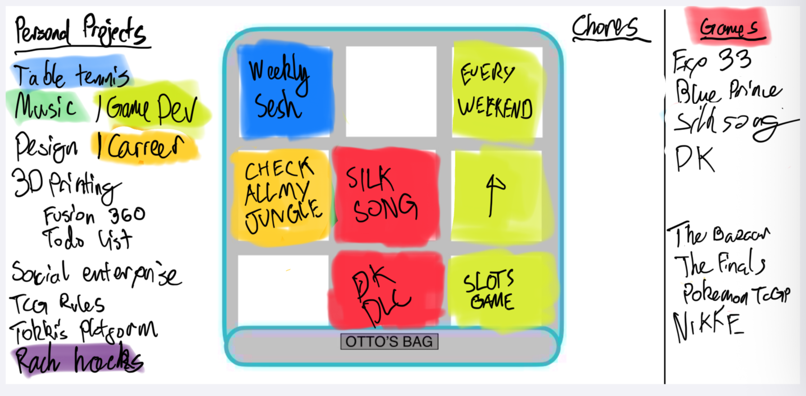

# Repo setup
This is a next.js project which will contain official resources for the Backlog Backpack, as well as the latest version of the spec. For local development run `npm install`, then check `package.json` > `scripts` for local development commands e.g. `npm run dev`.

# Intro to the Backlog Backpack tool
The Backlog Backpack is an organisational tool created to help people with ADHD visualise time/energy commitments. Its purpose is to reduce anxiety and foster self-empathy around hobbies, projects, and chores. It requires little maintenance, and can be set up with a just notepad and pencil.

# Key concepts

The **Backpack** in the centre is made up of nine **Pockets**. The entire **Backpack** represents your spare time/energy, split into equal parts. It doesn't include your work, school, or recurring household chores.

A filled **Pocket** represents an ongoing commitment until it is emptied or re-filled. Leaving some empty **Pockets** is encouraged, to represent your spare capacity for unplanned commitments.

> It may be helpful to think of the **Backpack** as a representation of your typical week. A sports club every Tuesday night could fill one **Pocket**. While spending an hour every day playing a new video game might fill two **Pockets**.

The metaphor of the **Backpack**, and some of the rules, are flexible based on your situation. See TODO for tweaking the number of **Pockets** in the **Backpack**. Other rule tweaks will be covered in [Setup](#setup).

# Setup

## Choose a medium

### Option A - Physical drawing
If using paper, you can work with pencils only, or [draw the template](#draw-the-template) with a pen, then switch to a pencil for the remaining sections. Whenever you update your Backpack, you will need to erase some content e.g. to empty Pockets, or remove Projects from the Backlog.

It's possible to use a whiteboard, which makes it easier to erase content. However, you may accidentally erase the backpack illustration or the grid lines. Once you're comfortable with your Backlog Backpack setup, you can use a permanent marker on a mini whiteboard to draw the Backpack's grid lines and any other permanent lines.

Regardless of the medium, it's recommended to use colour. You should have six different coloured pens/pencils or highlighters.

### Option B - Digital drawing
Use any drawing application to [draw the template](#draw-the-template) in a single colour. Export this image to use as a background layer, then complete the remaining sections on a foreground layer, allowing you to easily erase foreground content without redrawing the template. Alternatively, download the digital template at TODO, and set it as your background layer.

On iPad, you can use the Scribblet app to surface your drawing to the home screen as a widget. Create a new large widget and set the "Image" to your exported background image.

### Option C - On the app
There isn't an app for Backlog Backpack, but it's something I'm considering creating.

## Draw the template
Divide your canvas into two sections e.g. a 16:9 canvas with one 9:9 square on the right for the Backpack, and the remaining 7:9 rectangle on the left for the Backlog. Divide the sections by a single vertical line.

The Backlog section should have a title e.g. "My Backlog". Leave rest of the section blank until you [bring your Backlog to life](#bring-your-backlog-to-life).

Draw a square within the Backpack section, then split it into a 3:3 grid, with nine equal squares, these are your Pockets.

>Add as much or as little detail to the backpack to help illustrate the metaphor of a neatly organised bag that's equipping you to take part in your own unique adventure.

## Bring your Backlog to life
In the Backlog section, create a vertical list of Projects. These should be one or two words titles that broadly represent each Project, e.g:

- Table tennis
- Video games
- Music
- House
- Korean

Don't use verbs like "Play table tennis" or "Learn Korean". Create one entry for each Project that you are currently working on, as well as any that you want to begin/continue in the future.

> This step and [Fill your Pockets](#fill-your-pockets) are all about being honest with yourself and your current situation. Don't worry if your **Backlog** seems too large, your **Pockets** look empty, or your **Backpack** is overflowing. Get it all out of your head and onto the paper.

Creating multiple lists in your Backlog, or expanding a Project into sub-Projects is encouraged. Just separate them with headings. For example, change 'Video games' and 'Music' into headings, and split up the 'Kitchen remodel' into sub-Projects:

### Personal projects
- Table tennis
- Video games
    - Minecraft
    - Balatro
    - Hollow Knight
- Music
    - Piano
    - Production
- Korean
### Chores
- House
    - Kitchen remodel
    - New shelves

Each packed Project has an associated colour until it is unpacked.
Example lists include "Personal Projects", "Video Games", "Chores". Some Projects can be expanded into a list

## Fill your Pockets
## Review your Backpack
