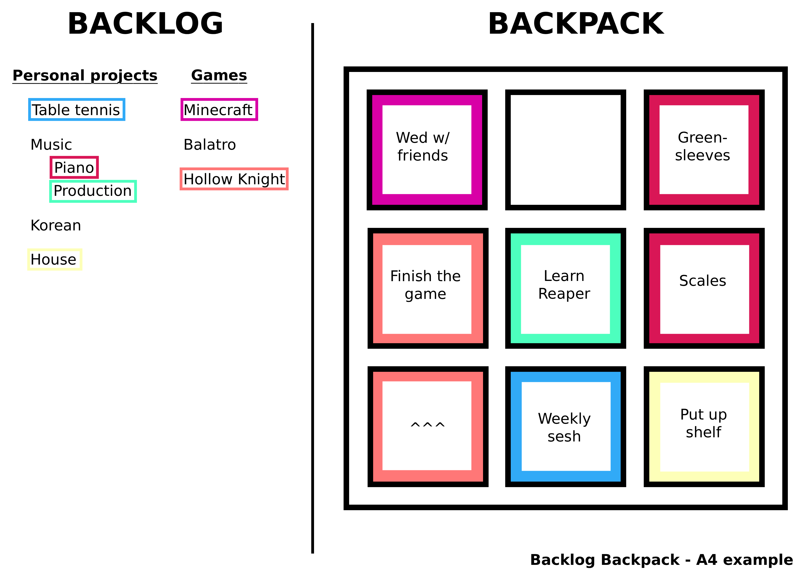

_Spec version 1.0.0_

# Repo setup
This is a next.js project which will contain official resources for the Backlog Backpack, as well as the latest version of the spec. For local development run `npm install`, then check `package.json` > `scripts` for local development commands e.g. `npm run dev`.

# Spec

The Backlog Backpack is an organisational tool created to help people with ADHD visualise time/energy commitments. Its purpose is to reduce anxiety and foster self-empathy around hobbies, projects, and chores. It requires little maintenance, and can be set up with a just notepad and pencil.

> The "TODO" phrase is used in some areas with incomplete content. These will be filled out in future versions of this spec.

## Example

# Key concepts
The Backpack in the centre is made up of nine Pockets. The entire Backpack represents your spare time/energy, split into equal parts. It doesn't include your work, school, or recurring household chores.

A filled Pocket represents an ongoing commitment until it is emptied or re-filled. Leaving some empty Pockets is encouraged, to represent your spare capacity for unplanned commitments.

> It may be helpful to think of the Backpack as a representation of your typical week. A sports club every Tuesday night could fill one Pocket. While spending an hour every day playing a new video game might fill two Pockets.

The metaphor of the Backpack, and some of the rules, are flexible based on your situation. See [Mods](#mods) for tweaking the number of Pockets in the Backpack. Other rule tweaks will be covered in [Setup](#setup).

# Setup

## Choose a medium

### Option A - Physical drawing
If using paper, you can work with pencils only, or draw the template with a pen (see [Draw the template](#draw-the-template)), then switch to a pencil for the remaining sections. Whenever you update your Backpack, you will need to erase some content e.g. to empty Pockets, or remove Projects from the Backlog.

It's possible to use a whiteboard, which makes it easier to erase content. However, you may accidentally erase the backpack illustration or the grid lines. Once you're comfortable with your Backlog Backpack setup, you can use a permanent marker on a mini whiteboard to draw the Backpack's grid lines and any other permanent lines.

Regardless of the medium, it's recommended to use colour. You should have six different coloured pens/pencils or highlighters.

### Option B - Digital drawing

Use any drawing application to draw the template (see [Draw the template](#draw-the-template)) in a single colour. Export this image to use as a background layer, then complete the remaining sections on a foreground layer, allowing you to easily erase foreground content without redrawing the template. Alternatively, [download the Digital template](public/README/a4-template.png), and set it as your background layer.

On iPad, you can use the Scribblet app to surface your drawing to the home screen as a widget. Create a new large widget and set the "Image" to your exported background image.

### Option C - On the app
TODO: Add instructions for installing and using the web app once it's complete.

## Draw the template
Divide your canvas into two sections e.g. a 16:9 canvas with one 9:9 square on the right for the Backpack, and the remaining 7:9 rectangle on the left for the Backlog. Divide the sections by a single vertical line.

The Backlog section should have a title e.g. "My Backlog". Leave rest of the section blank until you [write your backlog](#write-down-your-backlog)).

Draw a square within the Backpack section, then split it into a 3:3 grid, with nine equal squares, these are your Pockets.

> Add as much or as little detail to the backpack to help illustrate the metaphor of a neatly organised bag that's equipping you to take part in your own unique adventure.

## Write down your Backlog
In the Backlog section, create a vertical list of Projects. These should be one or two words titles that broadly represent each Project, for example:

- Table tennis
- Video games
- Music
- House
- Korean

Don't use verbs like "Play table tennis" or "Learn Korean". Create one entry for each Project that you are currently working on, as well as any that you want to begin/continue in the future.

> This step and [Fill your Pockets](#fill-your-pockets) are all about being honest with yourself and your current situation. Don't worry if your Backlog seems too large, your Pockets look empty, or your Backpack is overflowing. Get it all out of your head and onto the paper.

Creating multiple lists in your Backlog is encouraged, just separate them with headings, or create sub-projects under a Project. For example, make "Video games" into a heading and create a Project for each game, or create "Piano" and "Production" as sub-projects of "Music":

### Personal projects
- Table tennis
- Music
    - Piano
    - Production
- Korean
- House

### Video games
- Minecraft
- Balatro
- Hollow Knight

## Mark your packed Projects
Walk through each of your Projects, reading the title out loud, and considering whether that Project is packed or unpacked.

> Did you work on a project last week, are you working on it this week, will you work on it next week? If you answered yes to any of these questions, then you should mark the project as packed for now.

Mark each packed Project with a black dot, then count your total marked Projects. If you have more than six Projects marked, you must choose Projects to unpack until you are left with six or less.

Assign one of your six colours to each Project by highlighting or underlining the title, and remove the black dot. To continue the previous example, your Backlog might look like this:

### Personal projects
- Table tennis (blue)
- Music (no colour, only the sub-projects are packed)
    - Piano (red)
    - Production (green)
- Korean (no colour, it's not packed)
- House (yellow)

### Video games
- Minecraft (purple)
- Balatro (no colour, it's not packed)
- Hollow Knight (orange)

## Fill your Pockets
A filled Pocket represents a commitment or action associated with the matching Project. Colour-in Pockets (or draw an inner border) using one of your six colours per Pocket. Pockets with matching colours must be touching each other. You can represent a single larger commitment with multiple Pockets.

> If you run out of Pockets but you still have more Projects to pack, create temporary Pockets on some scrap paper so you can finish the exercise. In [Reflect and refine your Backpack](#reflect-and-refine-your-backpack) you will unpack Projects and empty Pockets until you're happy with your Backpack.

Add a short title in black to each one, for example:

| Column 1                 | Column 2             | Column 3              |
| ------------------------ | -------------------- | --------------------- |
| (purple) Wed w/ friends  |                      | (red) Greensleeves    |
| (orange) Finish the game | (green) Learn Reaper | (red) Scales practice |
| (orange) ^               | (blue) Weekly sesh   | (yellow) Put up shelf |

## Reflect and refine your Backpack
> Congratulations, you've packed your Backpack! It should be an accurate reflection of your interests and commitments, so take a moment to empathise with your reaction to this visualisation. Now it's time to use that reaction to pack a sustainable and focused Backpack that you're able to carry every day.

If your actual goals or capabilities don't match your current Backpack, then you need to re-pack before moving on. Choose to keep one or multiple Pockets empty, and consider packing less that six Projects. Then follow these steps:

1. Take a picture of the current state of the tool for reference.
2. Empty each Pocket in the Backpack.
3. Re-assign colours to the Projects that you're planning to pack.
4. Fill Pockets, one Project at a time.

# Usage

## Reference
Your Backlog Backpack is a passive tool which may stay unchanged for weeks or months, so it's important to surface it. That means permanently displaying it somewhere that you frequent at least once a week. For example:

- If using a portable whiteboard, prop it up on a shelf in your home.
- If creating a digital drawing, add it as a widget on your device's home screen (see [instructions for iPad](#option-b---digital-drawing))

## Maintenance

### Passive update
Your priorities and Projects will change throughout the year, and you should update your Backlog Backpack to reflect that. These changes happen at irregular intervals, so there are no restrictions on maintenance, other than a requirement to check-in with the tool at least once a month. To maintain the tool, follow the steps in [Write down your Backlog](#write-down-your-backlog) and [Fill your Pockets](#fill-your-pockets).

### Active planning
Alternatively, you can use the tool actively, to help you choose your priorities and allocate your time. This process takes 5 to 10 minutes.

1. Take a picture of the current state of the tool for reference.
2. Add any new Projects to your Backlog, even if you aren't going to pack them yet.
3. Remove any Projects that you've completed.
4. Empty each Pocket in the Backpack.
5. Re-assign colours to the six Projects that you're most likely to pack.
6. Fill Pockets, one Project at a time.
7. Reflect and refine your choices.
    - Consider how many Pockets you want to keep empty.
    - Consider packing less that six Projects.
8. Save your Backlog Backpack, and display it for reference.

> Choosing between these two approaches depends on your stability. If you are feeling grounded and on top of things, then you may only need to **update the tool to reflect what you are up to**.
>
> However, if you are feeling overwhelmed or unsure, then you should **use the tool to make decisions** on what Projects you are able to commit to, and then update what you do to match the tool.

# Mods
This section will host modifications to this spec that might be useful to some users of the Backlog Backpack. Community mods are encouraged, please [raise an issue on GitHub](https://github.com/ottoworld/backpack/issues) and I will add the mod here.

## More slots mod
TODO: Write a rules modification where the Backpack can expand to any number of Pockets.

# Other tools

## 3D printed checklist
https://makerworld.com/en/models/574923-shopping-checklist-print-in-place

TODO: Explain how and why I use a repeating daily checklist.

## Llama life
https://llamalife.co/

TODO: Explain how and why I use Llama Life for work.

## Obsidian
https://obsidian.md/

TODO: Explain how and why I use Obsidian for notes.